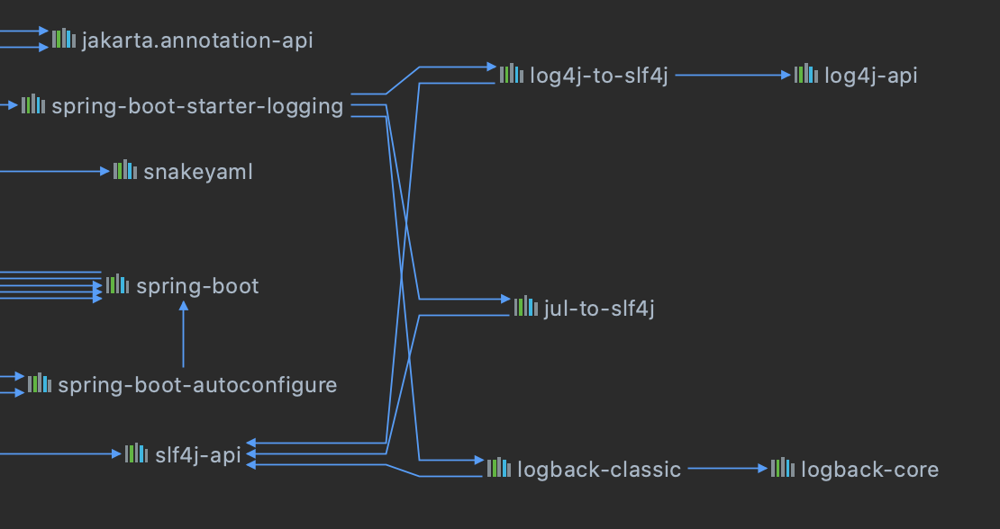
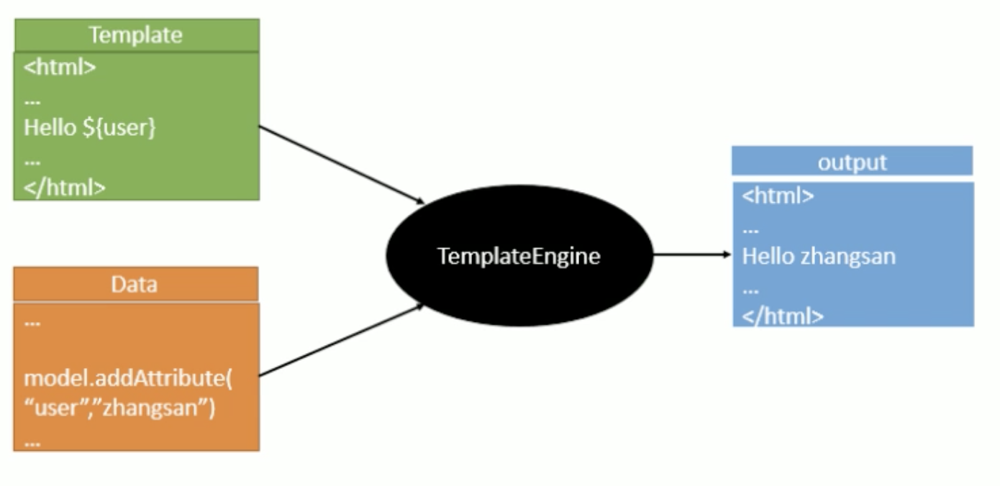
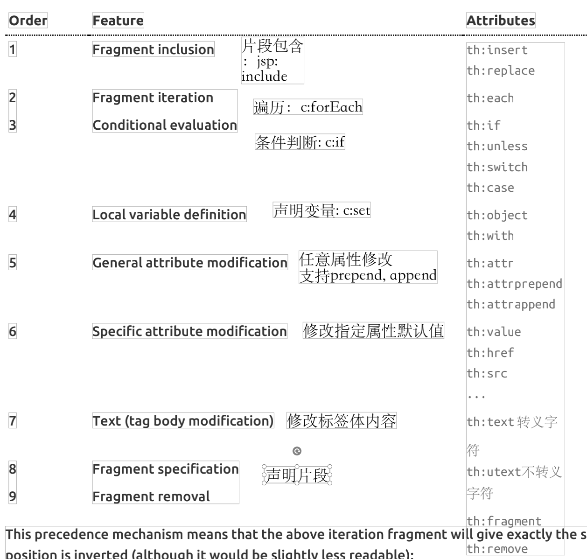
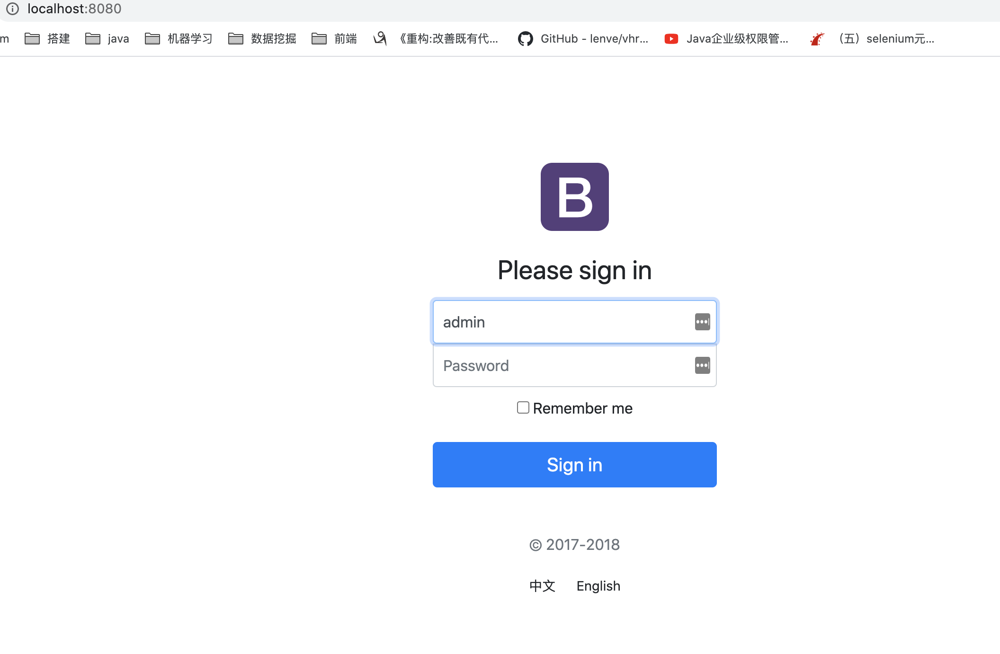
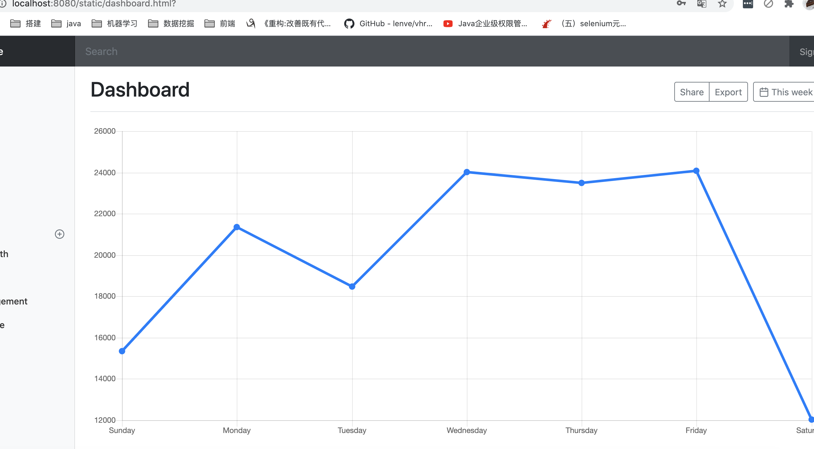
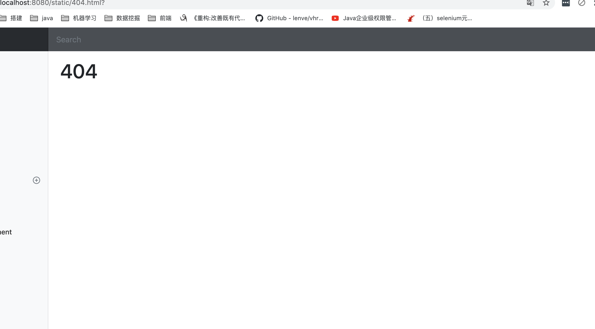
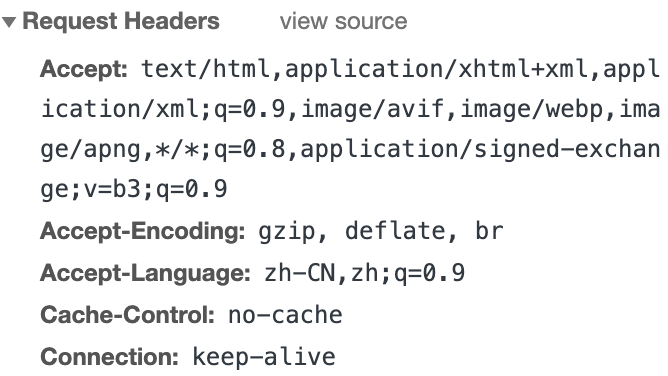
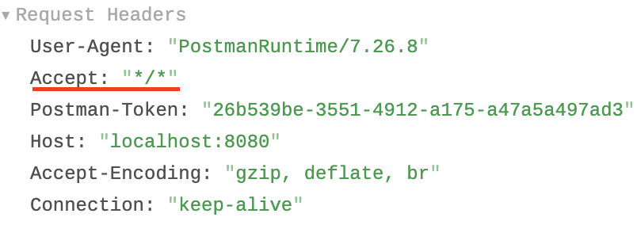

<!-- START doctoc generated TOC please keep comment here to allow auto update -->
<!-- DON'T EDIT THIS SECTION, INSTEAD RE-RUN doctoc TO UPDATE -->
**Table of Contents**  *generated with [DocToc](https://github.com/thlorenz/doctoc)*

- [一、Spring Boot 入门](#%E4%B8%80spring-boot-%E5%85%A5%E9%97%A8)
  - [1、Spring Boot简介](#1spring-boot%E7%AE%80%E4%BB%8B)
  - [2、微服务](#2%E5%BE%AE%E6%9C%8D%E5%8A%A1)
  - [3、环境准备](#3%E7%8E%AF%E5%A2%83%E5%87%86%E5%A4%87)
  - [4、Spring Boot HelloWorld](#4spring-boot-helloworld)
  - [5、Hello World探究](#5hello-world%E6%8E%A2%E7%A9%B6)
    - [1、POM文件](#1pom%E6%96%87%E4%BB%B6)
    - [2、主程序类、主入口类](#2%E4%B8%BB%E7%A8%8B%E5%BA%8F%E7%B1%BB%E4%B8%BB%E5%85%A5%E5%8F%A3%E7%B1%BB)
  - [6、使用Spring Initializer快速创建Spring Boot项目](#6%E4%BD%BF%E7%94%A8spring-initializer%E5%BF%AB%E9%80%9F%E5%88%9B%E5%BB%BAspring-boot%E9%A1%B9%E7%9B%AE)
- [二、配置文件](#%E4%BA%8C%E9%85%8D%E7%BD%AE%E6%96%87%E4%BB%B6)
  - [1、配置文件](#1%E9%85%8D%E7%BD%AE%E6%96%87%E4%BB%B6)
  - [2、YAML语法](#2yaml%E8%AF%AD%E6%B3%95)
    - [1、基本语法](#1%E5%9F%BA%E6%9C%AC%E8%AF%AD%E6%B3%95)
    - [2、值的写法](#2%E5%80%BC%E7%9A%84%E5%86%99%E6%B3%95)
      - [字面量：普通的值（数字、字符串、布尔）](#%E5%AD%97%E9%9D%A2%E9%87%8F%E6%99%AE%E9%80%9A%E7%9A%84%E5%80%BC%E6%95%B0%E5%AD%97%E5%AD%97%E7%AC%A6%E4%B8%B2%E5%B8%83%E5%B0%94)
  - [3、配置文件值注入](#3%E9%85%8D%E7%BD%AE%E6%96%87%E4%BB%B6%E5%80%BC%E6%B3%A8%E5%85%A5)
    - [1、properties配置文件在idea中默认utf-8可能会乱码](#1properties%E9%85%8D%E7%BD%AE%E6%96%87%E4%BB%B6%E5%9C%A8idea%E4%B8%AD%E9%BB%98%E8%AE%A4utf-8%E5%8F%AF%E8%83%BD%E4%BC%9A%E4%B9%B1%E7%A0%81)
    - [2、@Value获取值和@ConfigurationProperties获取值比较](#2value%E8%8E%B7%E5%8F%96%E5%80%BC%E5%92%8Cconfigurationproperties%E8%8E%B7%E5%8F%96%E5%80%BC%E6%AF%94%E8%BE%83)
    - [3、配置文件注入值数据校验](#3%E9%85%8D%E7%BD%AE%E6%96%87%E4%BB%B6%E6%B3%A8%E5%85%A5%E5%80%BC%E6%95%B0%E6%8D%AE%E6%A0%A1%E9%AA%8C)
    - [4、@PropertySource&@ImportResource](#4propertysourceimportresource)
  - [4、配置文件占位符](#4%E9%85%8D%E7%BD%AE%E6%96%87%E4%BB%B6%E5%8D%A0%E4%BD%8D%E7%AC%A6)
    - [1、随机数](#1%E9%9A%8F%E6%9C%BA%E6%95%B0)
    - [2、占位符获取之前配置的值，如果没有可以使用：指定默认值](#2%E5%8D%A0%E4%BD%8D%E7%AC%A6%E8%8E%B7%E5%8F%96%E4%B9%8B%E5%89%8D%E9%85%8D%E7%BD%AE%E7%9A%84%E5%80%BC%E5%A6%82%E6%9E%9C%E6%B2%A1%E6%9C%89%E5%8F%AF%E4%BB%A5%E4%BD%BF%E7%94%A8%E6%8C%87%E5%AE%9A%E9%BB%98%E8%AE%A4%E5%80%BC)
  - [5、Profile](#5profile)
    - [1、多Profile文件](#1%E5%A4%9Aprofile%E6%96%87%E4%BB%B6)
    - [2、yml支持多文档块方式](#2yml%E6%94%AF%E6%8C%81%E5%A4%9A%E6%96%87%E6%A1%A3%E5%9D%97%E6%96%B9%E5%BC%8F)
    - [3、激活指定profile](#3%E6%BF%80%E6%B4%BB%E6%8C%87%E5%AE%9Aprofile)
  - [6、配置文件加载位置](#6%E9%85%8D%E7%BD%AE%E6%96%87%E4%BB%B6%E5%8A%A0%E8%BD%BD%E4%BD%8D%E7%BD%AE)
  - [7、外部配置加载顺序](#7%E5%A4%96%E9%83%A8%E9%85%8D%E7%BD%AE%E5%8A%A0%E8%BD%BD%E9%A1%BA%E5%BA%8F)
  - [8、自动配置原理](#8%E8%87%AA%E5%8A%A8%E9%85%8D%E7%BD%AE%E5%8E%9F%E7%90%86)
    - [1、自动配置原理](#1%E8%87%AA%E5%8A%A8%E9%85%8D%E7%BD%AE%E5%8E%9F%E7%90%86)
    - [2、细节](#2%E7%BB%86%E8%8A%82)
      - [1、@Conditional派生注解（Spring注解版原生的@Conditional作用）](#1conditional%E6%B4%BE%E7%94%9F%E6%B3%A8%E8%A7%A3spring%E6%B3%A8%E8%A7%A3%E7%89%88%E5%8E%9F%E7%94%9F%E7%9A%84conditional%E4%BD%9C%E7%94%A8)
- [三、日志](#%E4%B8%89%E6%97%A5%E5%BF%97)
  - [1、日志框架](#1%E6%97%A5%E5%BF%97%E6%A1%86%E6%9E%B6)
  - [2、SLF4j使用](#2slf4j%E4%BD%BF%E7%94%A8)
    - [1、如何在系统中使用SLF4j](#1%E5%A6%82%E4%BD%95%E5%9C%A8%E7%B3%BB%E7%BB%9F%E4%B8%AD%E4%BD%BF%E7%94%A8slf4j)
    - [2、遗留问题](#2%E9%81%97%E7%95%99%E9%97%AE%E9%A2%98)
  - [3、SpringBoot日志关系](#3springboot%E6%97%A5%E5%BF%97%E5%85%B3%E7%B3%BB)
  - [4、日志使用](#4%E6%97%A5%E5%BF%97%E4%BD%BF%E7%94%A8)
    - [1、默认配置](#1%E9%BB%98%E8%AE%A4%E9%85%8D%E7%BD%AE)
    - [2、指定配置](#2%E6%8C%87%E5%AE%9A%E9%85%8D%E7%BD%AE)
  - [5、切换日志框架](#5%E5%88%87%E6%8D%A2%E6%97%A5%E5%BF%97%E6%A1%86%E6%9E%B6)
- [四、Web开发](#%E5%9B%9Bweb%E5%BC%80%E5%8F%91)
  - [2、SpringBoot对静态资源的映射规则](#2springboot%E5%AF%B9%E9%9D%99%E6%80%81%E8%B5%84%E6%BA%90%E7%9A%84%E6%98%A0%E5%B0%84%E8%A7%84%E5%88%99)
  - [3、模版引擎](#3%E6%A8%A1%E7%89%88%E5%BC%95%E6%93%8E)
    - [1、引入 thymeleaf](#1%E5%BC%95%E5%85%A5-thymeleaf)
    - [2、thymeleaf语法](#2thymeleaf%E8%AF%AD%E6%B3%95)
    - [3、语法规则](#3%E8%AF%AD%E6%B3%95%E8%A7%84%E5%88%99)
  - [4、SpringMVC自动配置](#4springmvc%E8%87%AA%E5%8A%A8%E9%85%8D%E7%BD%AE)
    - [2、扩展SpringMVC](#2%E6%89%A9%E5%B1%95springmvc)
    - [3、全面接管SpringMVC](#3%E5%85%A8%E9%9D%A2%E6%8E%A5%E7%AE%A1springmvc)
  - [5、如何修改SpringBoot的默认配置](#5%E5%A6%82%E4%BD%95%E4%BF%AE%E6%94%B9springboot%E7%9A%84%E9%BB%98%E8%AE%A4%E9%85%8D%E7%BD%AE)
  - [6、RestfulCRUD](#6restfulcrud)
  - [7 错误处理机制](#7-%E9%94%99%E8%AF%AF%E5%A4%84%E7%90%86%E6%9C%BA%E5%88%B6)
  - [8 配置嵌入式Servlet容器](#8-%E9%85%8D%E7%BD%AE%E5%B5%8C%E5%85%A5%E5%BC%8Fservlet%E5%AE%B9%E5%99%A8)
    - [1）如何定制和修改Servlet容器的相关配置](#1%E5%A6%82%E4%BD%95%E5%AE%9A%E5%88%B6%E5%92%8C%E4%BF%AE%E6%94%B9servlet%E5%AE%B9%E5%99%A8%E7%9A%84%E7%9B%B8%E5%85%B3%E9%85%8D%E7%BD%AE)
    - [2）注册Servlet三大组件【Servlet、Filter、Listener】](#2%E6%B3%A8%E5%86%8Cservlet%E4%B8%89%E5%A4%A7%E7%BB%84%E4%BB%B6servletfilterlistener)
    - [3) 替换为其他嵌入式Servlet容器](#3-%E6%9B%BF%E6%8D%A2%E4%B8%BA%E5%85%B6%E4%BB%96%E5%B5%8C%E5%85%A5%E5%BC%8Fservlet%E5%AE%B9%E5%99%A8)
    - [4）嵌入式Servlet容器自动配置原理](#4%E5%B5%8C%E5%85%A5%E5%BC%8Fservlet%E5%AE%B9%E5%99%A8%E8%87%AA%E5%8A%A8%E9%85%8D%E7%BD%AE%E5%8E%9F%E7%90%86)
  - [9 使用外置的Servlet容器](#9-%E4%BD%BF%E7%94%A8%E5%A4%96%E7%BD%AE%E7%9A%84servlet%E5%AE%B9%E5%99%A8)
- [五、 Docker](#%E4%BA%94-docker)
  - [1、简介](#1%E7%AE%80%E4%BB%8B)
  - [2、核心概念](#2%E6%A0%B8%E5%BF%83%E6%A6%82%E5%BF%B5)
  - [3、安装docker](#3%E5%AE%89%E8%A3%85docker)
  - [4、docker常用命令&操作](#4docker%E5%B8%B8%E7%94%A8%E5%91%BD%E4%BB%A4%E6%93%8D%E4%BD%9C)

<!-- END doctoc generated TOC please keep comment here to allow auto update -->


# 一、Spring Boot 入门

## 1、Spring Boot简介

> 简化Spring应用开发的一个框架
>
> 整个Spring技术栈的一个大整合
>
> J2EE开发的一站式解决方案

## 2、微服务

2014，Martin Fowler

微服务：架构风格

一个应用应该是一组小型服务，可以通过HTTP的方式进行互通

每一个功能元素最终都是一个可独立替换和独立升级的软件单元

详细参照微服务[文档](https://microservices.io/)

## 3、环境准备

- jdk1.8 : Spring Boot 2.4.0
- maven 3.x: maven 3.3以上版本
- IntellijIDEA 2020.2
- SpringBoot 2.4.0.RELEASE
  统一环境

  ### 1、MAVEN设置 

  给maven的settings.xml配置文件的profiles标签添加

  ### 2、IDEA 设置

## 4、Spring Boot HelloWorld

一个功能：

浏览器发送hello请求，服务器接受请求并处理，响应Hello World字符串

编写一个主程序；启动Spring Boot应用

```java
/*
    @SpringBootApplication 来标注一个主程序类，说明这是一个Spring Boot应用
*/

@SpringBootApplication //SpringBoot的主配置类
public class HelloWorldMainApplication {
    public static void main(String[] args) {

        // Spring启动应用
        SpringApplication.run(HelloWorldMainApplication.class, args);
    }
}
```

编写相关的controller service

```java
@Controller
public class HelloController {

    @ResponseBody
    @RequestMapping("/hello")
    public String hello() {
        return "Hello World!";
    }
}
```

运行主程序测试

打包 java -jar运行程序

## 5、Hello World探究

### 1、POM文件

 	**1、父项目**

​	Spring Boot的版本仲裁中心；

​	以后我们导入依赖默认是不需要写版本；（没有在dependencies里面管理的依赖自然需要声明版本号）

​	**2、导入的依赖**

```xml
<dependency>
    <groupId>org.springframework.boot</groupId>
    <artifactId>spring-boot-starter-web</artifactId>
</dependency>
```

Spring-boot-starter-web:

​		spring-boot-starter : spring-boot场景启动器；帮我们导入了web模块正常运行所依赖的组件；

​		spring boot将所有的功能场景都抽取出来，做成一个个的starters（启动器），只需要在项目里面引入这些starter相关场景的所有依赖都会导入进来。要用什么功能就导入什么场景的启动器

### 2、主程序类、主入口类

@SpringBootConfiguration:Spring Boot的配置类;

​				标注在某个类上，表示这是一个Spring Boot的配置类；

​				@**Configuration** : 配置类上来标注这个注解；

​						配置类 ----- 配置文件；配置类也是容器中的一个组件；@Component

@**EnableAutoConfiguration** : 开启自动配置功能；

@**AutoConfigurationPackage** : 自动配置包

## 6、使用Spring Initializer快速创建Spring Boot项目

* 主程序已经生成好了，只需要我们自己的逻辑
* resources文件夹中目录结构
  * static : 保存所有的静态资源;  js css images
  * templates : 保存所有的模版页面；（Spring Boot默认jar包使用嵌入式的Tomcat，默认不支持JSP页面）；可以使用模版引擎（freemarker、thymeleaf）；
  * application.properties : Spring Boot应用的配置文件；

# 二、配置文件

## 1、配置文件

SpringBoot使用一个全局的配置文件，配置文件名是固定的；

* application.properties
* application.yml

配置文件的作用：修改SpringBoot自动配置的默认值；SpringBoot在底层都给我们自动配置好；

YAML (YAML Ain' t Markup Language)

​	YAML A Markup Language : 是一个标记语言

​	YAML isn't Markup Language : 不是一个标记语言

标记语言：

​		以前的配置文件；大多都使用的是 xxx.xml 文件；

​		YAML ：以数据为中心，比json、xxml等更适合做配置文件；

​		YAML：配置例子

```yaml
server:
	port: 8081
```

​		XML :

```xml
<server>
		<port>8081</port>
</server>
```

## 2、YAML语法

### 1、基本语法

k:(空格)v : 表示一对键值对（空格必须有）

以空格的缩进来控制层级关系；只要是左对齐的一列数据，都是同一个层次的

```yaml
server:
		port: 8081
		path: /hello
```

属性和值也是大小写敏感

### 2、值的写法

#### 字面量：普通的值（数字、字符串、布尔）

k: v :字面直接来写；

​		字符串默认不用加上单引号或者双引号；

​		"" : 双引号；不会转移字符串里面的特殊字符；特殊字符会作为本身想要表达的意思

​					name: "zhangsan \n lisi" : 输出; zhangsan 换行 lisi

​		'': 单引号；会转义特殊字符，特殊字符最终只是一个普通的字符串数据

​					name: 'zhangsan \n lisi' : 输出; zhangsan \n lisi

对象、Map（属性和值）（键值对）：

​	k: v : 在下一行来写对象的属性和值的关系；注意缩进

​			对象还是k:  v的方式

```yaml
friends:
				lastname: zhangsan
				age: 20
```

行内写法：

```yaml
friends: {lastName: zhangsan, age: 18}
```


数组（List、Set）：

用-值表示数组中的一个元素

```yaml
pets:
	- cat
	- dog
	- pig
```

行内写法

```yaml
pets: [cat,dog,pig]
```

## 3、配置文件值注入

### 1、properties配置文件在idea中默认utf-8可能会乱码

Preferences - file encoding 改为 GBK

配置文件

```yaml
person:
  lastName: zhangsan
  age: 18
  boss: false
  birth: 2017/12/12
  maps: {k1: v1, k2: 12}
  lists:
    - lisi
    - zhangsan
  dog:
    name: 小狗
    age: 2
```

javaBean :

```java
/*
    将配置文件中配置的每一个属性的值，映射到这个组件中
    @ConfigurationProperties:告诉SpringBoot将本类中的所有属性和配置文件中相关的配置进行绑定 默认从全局文件中获取值
        prefix = "person" : 配置文件中哪个下面的所有属性进行一一映射
 */
@Component
@ConfigurationProperties(prefix = "person")

public class Person {

    private String lastName;
    private Integer age;
    private Boolean boss;
    private Date birth;

    private Map<String, Object> maps;
    private List<Object> lists;
    private Dog dog;
```

我们可以导入配置文件处理器，以后编写配置就有提示了

```xml
<!--  -->
<dependency>
    <groupId>org.springframework.boot</groupId>
    <artifactId>spring-boot-configuration-processor</artifactId>
    <optional>true</optional>
</dependency>
```

### 2、@Value获取值和@ConfigurationProperties获取值比较

|                      | @ConfigurationProperties | @Value     |
| -------------------- | ------------------------ | ---------- |
| 功能                 | 批量注入配置文件中的属性 | 一个个指定 |
| 松散绑定（松散语法） | 支持                     | 不支持     |
| SpEL                 | 不支持                   | 支持       |
| JSR303数据校验       | 支持                     | 不支持     |
| 复杂类型封装         | 支持                     | 不支持     |

配置文件yml还是properties他们都能获取到值；

如果说，我们只是在某个业务逻辑中需要获取一下配置文件中的某项值，使用@Value;

如果说，我们专门编写了一个javaBean来和配置文件进行映射时，我们就直接使用@ConfigurationProperties;

### 3、配置文件注入值数据校验

```java
@Component
@ConfigurationProperties(prefix = "person")
@Validated
public class Person {

    /*
        <bean class="Person">
            <property name="lastName" value="字面量"/${key}从环境变量、配置文件中个获取值/#{SpEL}"></property>
        </bean>
    */
//    @Value("${person.last-name}")
    // lastName必须是邮箱格式
    @Email
    private String lastName;
//    @Value("#{11*2}")
    private Integer age;
//    @Value("true")
    private Boolean boss;
    private Date birth;

    private Map<String,Object> maps;
    private List<Object> lists;
    private Dog dog;
```

### 4、@PropertySource&@ImportResource

@PropertySource : 加载指定的配置文件；

```java
/*    
		只有这个组件是容器中的组件，才能容器提供的@ConfigurationProperties功能
    @ConfigurationProperties(prefix = "person") 默认从全局配置文件中获取值
*/

@PropertySource(value = {"classpath:person.properties"})
@Component
@ConfigurationProperties(prefix = "person")
//@Validated
public class Person {

    /*
        <bean class="Person">
            <property name="lastName" value="字面量"/${key}从环境变量、配置文件中个获取值/#{SpEL}"></property>
        </bean>
    */
//    @Value("${person.last-name}")
    // lastName必须是邮箱格式
    //@Email
    private String lastName;
//    @Value("#{11*2}")
    private Integer age;
//    @Value("true")
    private Boolean boss;
    private Date birth;

    //@Value("${person.map}")
    private Map<String,Object> maps;
    private List<Object> lists;
    private Dog dog;
```

@ImportResource : 导入Spring的配置文件，让配置文件里面的内容生效；

Spring Boot里面没有Spring的配置文件，我们自己编写的配置文件，也不能自动识别；

想让Spring的配置文件生效，加载进来；@ImportResource标注在一个配置类上

```java
@ImportResource(locations = {"classpath:beans.xml"})
导入Spring的配置文件让其生效
```
不来编写Spring的配置文件
```xml
<?xml version="1.0" encoding="UTF-8"?>
<beans xmlns="http://www.springframework.org/schema/beans"
       xmlns:xsi="http://www.w3.org/2001/XMLSchema-instance"
       xsi:schemaLocation="http://www.springframework.org/schema/beans http://www.springframework.org/schema/beans/spring-beans.xsd">

    <bean id="helloService" class="com.atguigu.springboot.service.HelloService"></bean>
</beans>
```
SpringBoot推荐给容器中添加组件的方式；推荐使用全注解的方式
1、配置类=====Spring配置文件
2、使用@Bean给容器中添加组件
```java
/*
    @Configuration:指明当前类是一个配置类；就是来替代之前的Spring配置文件
    在配置文件中用<bean></bean>标签添加组件
*/

@Configuration
public class MyAppConfig {

    // 将方法的返回值添加到容器中；容器中这个组件默认的id就是方法名
    @Bean
    public HelloService helloService() {
        System.out.println("配置类@Bean给容器中添加组件了...");
        return new HelloService();
    }
}
```
## 4、配置文件占位符
### 1、随机数
```java
${random.value}、${random.int}、${random.long}
${random.int(10)}、${random.int[1024,65536]}
```
### 2、占位符获取之前配置的值，如果没有可以使用：指定默认值
```properties
server.port=8081

person.last-name=张三${random.uuid}
person.age=${random.int}
person.birth=2017/12/12
person.boss=false
person.maps..k1=v1
person.maps..k2=14
person.lists=a,b,c
person.dog.name=${person.last-name}_dog
person.dog.age=15
```

## 5、Profile
### 1、多Profile文件
我们在主配置文件编写的时候，文件名可以是 application-{profile}.properties/yml
默认使用application.properties
### 2、yml支持多文档块方式
```yaml
server:
  port: 8081
spring:
  profiles:
    active: dev
---
server:
  port: 8082
spring:
  config:
    activate:
      on-profile: dev
---
server:
  port: 8083
spring:
  config:
    activate:
      on-profile: prod #指定属于哪个环境
```
### 3、激活指定profile
1、在配置文件中指定 spring.profiles.active=dev
2、命令行模式
	java -jar spring-boot-02-config-0.0.1-SNAPSHOT.jar --spring.profiles.active=dev;
	可以直接在测试的时候，配置传入命令行参数
3、虚拟机参数
	-Dspring.profiles.active=dev

## 6、配置文件加载位置
SpringBoot启动会扫描一下位置的application.properties或者application.yml文件作为Spring Boot的默认配置文件
-file:./config/
-file:./
-classpath:/config/
-classpath:/
优先级`由高到低`，最高优先级的配置会覆盖低优先级的配置；
SpringBoot会从四个位置全部加载配置文件；互不配置；

```yaml
server.port=8088
# 配置web访问路径
server.servlet.context-path=/boot02
```
`spring.config.location` 更改默认配置文件的位置
打包的项目可以用命令行参数指定配置文件的新位置

```bash
java -jar spring-boot-02-config-02-0.0.1-SNAPSHOT.jar --spring.config.location=/home/ubuntu/application.properties
```

## 7、外部配置加载顺序

**Spring Boot也可以从以下位置加载配置；优先级从高到低；高优先级的配置覆盖低优先级的配置，所有的配置会形成互补配置**

1.命令行参数

2.来自java:comp/env的JNDI属性

3.Java系统属性(Syetem.getProperties())

4.操作系统环境变量

5.RandomValuePropertySource配置的random.*属性值

**由jar包外向jar包内进行寻找；**

**优先加载带profile**

6.jar包外部的application-{profile}.properties或application.yml(带spring.profile)配置文件

7.jar包外部的application-{profile}.properties或application.yml(带spring.profile)配置文件


**再来加载不带profile**

8.jar包外部的application.properties或application.yml(带spring.profile)配置文件

9.jar包外部的application.properties或application.yml(带spring.profile)配置文件


10.@Configuration注解类上的@PropertySource

11.通过SpringApplication.setDefaultProperties指定的默认属性

所有支持的配置加载来源

[配置来源](https://docs.spring.io/spring-boot/docs/current/reference/html/spring-boot-features.html#boot-features-external-config)

## 8、自动配置原理

### 1、自动配置原理

(1) SpringBoot启动的时候加载主配置类，开启了自动配置功能 @EnableAutoconfiguration

(2) @EnableAutoConfiguration 作用 :

* 利用EnableAutoConfigurationImportSelector给容器中导入一些组件
*  可以查看selectImports()方法的内容；
* List<String> configurations = getCandidateConfigurations(annotationMetadata, attributes);获取候选的配置

```
SpringFactoriesLoader.loadFactoryNames()
扫描所有jar包类路径下 META-INF/spring.factories
把扫描到的这些文件的内容包装成properties对象
从properties中获取到EnableAutoConfiguration.class类(类名)对应的值，然后把他们添加在容器中
```

**将类路径下 META-INF/spring.factories里面配置的所有EnableAutoConfiguration的值加入到了容器中;**

每个这样的 xxxAutoConfiguration类都是容器中的一个组件，都加入到容器中；用他们来做自动配置；

(3) 每一个自动配置类进行自动配置

(4) 以HttpEncodingAutoConfiguration为例解释自动配置原理

```java
@Configuration // 表示这是一个配置类，以前编写的配置文件一样，也可以给容器中添加组件
@EnableConfigurationProperties(HttpEncodingProperties.class) //启动指定类的
// ConfigurationProperties功能；将配置文件中对应的值和HttpEncodingProperties绑定起来；
@ConditionalOnWebApplication // Spring底层@Conditional注解（Spring注解版），根据不同的条件，如果满足指定的条件，整个配置类里面的配置就会生效；判断当前应用是否是web应用，如果是，当前配置类生效
@ConditionalOnClass(CharacterEncodingFilter.class) // 判断当前项目有没有这个类CharacterEncodingFilter;SpringMVC中进行乱码解决的过滤器
@ConditionalOnProperty(prefix = "spring.http.encoding", value = "enabled", matchIfMissing = true) // 判断配置文件中是否存在某个配置 spring.http.encoding.enables；如果不存在，判断也是成立的
// 即使我们配置文件中不配置spring.http.encoding.enabled=true，也是默认生效的;
public class HttpEncodingAutoConfiguration {
```

根据当前不同的条件判断，

```java
spring.http.encoding.enabled=true
spring.http.encoding.charset=utf-8
spring.http.encoding.force=true
// 以上均失效
// Spring Boot 2.4.0版本生效的为以下
server.servlet.encoding.enabled=true
server.servlet.encoding.charset=utf-8
server.servlet.encoding.force=true
```

(5) 所有在配置文件中能配置的属性都是在xxxxProperties类中封装

```java
@ConfigurationProperties(prefix = "spring.http.encoding") // 从配置文件中获取指定的值和bean的属性进行绑定
publi class HttpEncodingProperties {
  
  public static final Charset DEFAULT_CHARSET = Charset.forName("UTF-8");
}
```

精髓：

​		1、SpringBoot 启动会加载大量的自动配置类

​		2、我们看我们需要的功能有没有SpringBoot默认写好的自动配置类

​		3、我们再来看这个自动配置类中到底配置了哪些组件（只要我们要用的组件有，我们就不需要再来配置了）

​		4、给容器中自动配置类添加组件的时候，会从properties类中获取某些属性。我们就可以在配置文件中指定这些属性的值

xxxxAutoConfiguration : 自动配置类

给容器中添加组件

xxxxProperties : 封装配置文件中相关属性

### 2、细节

#### 1、@Conditional派生注解（Spring注解版原生的@Conditional作用）

作用：必须是@Conditional指定的条件成立，才给容器中添加组件，配置里面的所有内容才生效；

| @Conditional扩展注解            | 作用（判断是否满足当前指定条件）                 |
| ------------------------------- | ------------------------------------------------ |
| @ConditionalOnJava              | 系统的Java版本是否符合要求                       |
| @ConditionalOnMissingBean       | 容器中不存在指定Bean                             |
| @ConditionalOnExpression        | 满足SpEL表达式指定                               |
| @ConditionalOnClass             | 系统中有指定的类                                 |
| @ConditionalOnMissingClass      | 系统中没有指定的类                               |
| @ConditionalOnSingleCandidate   | 容器中只有一个指定的Bean，或者这个Bean是首选Bean |
| @ConditionalOnProperty          | 系统中指定的属性是否有指定的值                   |
| @ConditionalOnResource          | 类路径下是否存在指定资源文件                     |
| @ConditionalOnWebApplication    | 当前是web环境                                    |
| @ConditionalOnNotWebApplication | 当前不是web环境                                  |
| @ConditionalOnJndi              | JNDI存在指定项                                   |

自动配置类必须在一定的条件下才能生效,我们可以通过 `debug=true`属性；来让控制台打印自动配置报告，这样就知道哪些自动配置类生效了

```bash
CONDITIONS EVALUATION REPORT
============================


Positive matches: (自动配置类启用的)
-----------------

   AopAutoConfiguration matched:
      - @ConditionalOnProperty (spring.aop.auto=true) matched (OnPropertyCondition)

   AopAutoConfiguration.ClassProxyingConfiguration matched:
      - @ConditionalOnMissingClass did not find unwanted class 'org.aspectj.weaver.Advice' (OnClassCondition)
      - @ConditionalOnProperty (spring.aop.proxy-target-class=true) matched (OnPropertyCondition)
```


# 三、日志

## 1、日志框架

市面上的日志框架：

JUL、JCL、JBOSS-logging、logback、log4j、log4j2、slf4j...

| 日志门面（日志的抽象层）                                     | 日志实现                                       |
| ------------------------------------------------------------ | ---------------------------------------------- |
| ~~JUL(Jakarta Commons Logging)~~  SLF4j(Simple Loggin Accade for Java)  ~~jboss-logging~~ | Log4j  JUL (java.util.logging)  Log4j2 Logback |

左边选个门面（抽象层），右边来选一个实现；

日志门面： SLF4j

日志实现：Logback

SpringBoot 采用 SLF4j + Logback

## 2、SLF4j使用

### 1、如何在系统中使用SLF4j

给系统导入slf4j的jar和 logback的实现jar

```java
import org.slf4j.Logger;
import org.slf4j.LoggerFactory;

public class HelloWorld {
  public static void main(String[] args) {
    Logger logger = LoggerFactory.getLogger(HelloWorld.class);
    logger.info("Hello World");
  }
}
```

图示：


每一个日志的实现框架都有自己的配置文件。使用slf4j以后，配置文件还是做成日志实现框架自己本身的配置文件

### 2、遗留问题

（slf4j+logback）：Spring (commons-logging)、Hibernate（jboss-logging）、MyBatis、xxxx统一日志记录，即使是别的框架和我一起统一使用slf4j进行输出


**如何让系统中所有的日志都统一到slf4j**

1、将系统中其他日志框架先排除出去

2、用中间包来替换原有的日志框架

3、我们导入slf4j其他的实现

## 3、SpringBoot日志关系

```xml
<dependency>
	<groupId>org.springframework.boot</groupId>
	<artifactId>spring-boot-starter-test</artifactId>
	<scope>test</scope>
</dependency>
```


SpringBoot使用它来做日志功能

```xml
<dependency>
	<groupId>org.springframework.boot</groupId>
  <artifactId>spring-boot-starter-logging</artifactId>
</dependency>
```

底层依赖关系



总结：

（1）SpringBoot底层也是使用slf4j + logback的方式进行日志记录

（2）SpringBoot也把其他的日志都替换成了 slf4j

（3）中间替换包

（4）如果我们要引入其他框架，一定要把这个框架的默认日志依赖移除掉

​				Spring框架用的是commons-logging;

```xml
<dependency>
	<groupId>org.springframework</groupId>
  <artifactId>spring-core</artifactId>
  <exclusions>
  	<exclusion>
    	<groupId>commons-logging</groupId>
      <artifactId>commons-logging</artifactId>
    </exclusion>
  </exclusions>
</dependency>
```

**SpringBoot能自动适配所有的日志，而且底层使用 slf4j + logback 的方式记录日志，引入其他框架的时候，只需要把这个框架依赖的日志框架排除掉;**

## 4、日志使用

### 1、默认配置

SpringBoot默认帮我们配置好了日志

```java
    // 记录器
		Logger logger = LoggerFactory.getLogger(getClass());
    @Test
    public void contextLoads() {

        // 日志的级别，由低到高 trace<debug<info<warn<error
        // 可以调整输出的日志级别；日志机就只会在这个级别以以后的高级别生效
        logger.trace("这是trace日志...");
        logger.debug("这是debug日志...");
        // SpringBoot默认给我们使用的是info级别，没有指定级别的就用SpringBoot默认规定的级别 root级别
        logger.info("这是info日志...");
        logger.warn("这是warn日志...");
        logger.error("这是error日志...");
    }
```

```
日志输出格式：
		%d表示日期时间,
		%thread表示线程名,
		%-5level: 级别从左显示5个字符宽度
		%logger{50} 表示logger名字最长50个字符，否则按照句点分割。
		%msg: 日志消息,
		%n是换行符
		%d{yyyy-MM-dd HH:mm:ss.SSS} [%thread] %5level %logger{50} - %msg%n
```

SpringBoot修改日志的默认配置

```properties
logging.level.com.atguigu=trace

# logging.file.path=
# 不指定路径在当前项目下生成springboot.log日志
# 可以指定完整的路径
logging.file.name=springboot.log

# 在控制台输出的日志的格式
logging.pattern.console=%d{yyyy-MM-dd} [%thread] %-5level %logger{50} - %msg%n
# 指定文件中日志输出的格式
logging.pattern.file=%d{yyyy-MM-dd} === [%thread] %5level %logger{50} - %msg%n
```

### 2、指定配置

给类路径下放上每个日志框架自己的配置文件即可；SpringBoot就不使用它默认配置的了

| Logging System         | Customization                                                |
| ---------------------- | ------------------------------------------------------------ |
| Logback                | Logback-spring.xml, logback-spring.groovy, logback.xml or logback.groovy |
| Log4j2                 | Log4j2-spring.xml or log4j2.xml                              |
| JDK(Java Util Logging) | logging.properties                                           |

logback.xml : 直接就被日志框架识别了

Logback-spring.xml : 日志框架就不直接加载日志的配置项，由SpringBoot解析日志配置，可以使用SpringBoot的高级Profile功能

```xml
<springProfile name="staging">
		<!-- configuration to be enabled when the "staging" profile is active -->
  	可以指定某段配置只是在某个环境下生效
</springProfile>
```
如果使用logback.xml作为日志配置文件，还要使用profile功能，会有以下错误
```java
no application action for [springProfile]
```
```xml
<appender name="stdout" class="ch.qos.logback.core.ConsoleAppender">
        <!--
        日志输出格式：
			%d表示日期时间，
			%thread表示线程名，
			%-5level：级别从左显示5个字符宽度
			%logger{50} 表示logger名字最长50个字符，否则按照句点分割。 
			%msg：日志消息，
			%n是换行符
        -->
        <layout class="ch.qos.logback.classic.PatternLayout">
            <pattern>%d{yyyy-MM-dd HH:mm:ss.SSS} [%thread] %-5level %logger{50} - %msg%n</pattern>
        </layout>
</appender>
```

## 5、切换日志框架

可以按照slf4j的日志适配图，进行相关的切换;


# 四、Web开发

使用SpringBoot;

1）、创建SpringBoot应用，选中我们需要的模块；

2）、SpringBoot已经默认将这些场景配置好了，只需要在配置文件中指定少量配置就可以运行起来

3）、自己编写业务代码


**自动配置原理**

```java
xxxxAutoconfiguration:帮我们给容器中自动配置组件;
xxxxProperties:配置类来封装配置文件的内容;
```

## 2、SpringBoot对静态资源的映射规则


```java
public void addResourceHandlers(ResourceHandlerRegistry registry) {
            if (!this.resourceProperties.isAddMappings()) {
                logger.debug("Default resource handling disabled");
            } else {
                Duration cachePeriod = this.resourceProperties.getCache().getPeriod();
                CacheControl cacheControl = this.resourceProperties.getCache().getCachecontrol().toHttpCacheControl();
                if (!registry.hasMappingForPattern("/webjars/**")) {
                    this.customizeResourceHandlerRegistration(registry.addResourceHandler(new String[]{"/webjars/**"}).addResourceLocations(new String[]{"classpath:/META-INF/resources/webjars/"}).setCachePeriod(this.getSeconds(cachePeriod)).setCacheControl(cacheControl).setUseLastModified(this.resourceProperties.getCache().isUseLastModified()));
                }

                String staticPathPattern = this.mvcProperties.getStaticPathPattern();
                if (!registry.hasMappingForPattern(staticPathPattern)) {
                    this.customizeResourceHandlerRegistration(registry.addResourceHandler(new String[]{staticPathPattern}).addResourceLocations(WebMvcAutoConfiguration.getResourceLocations(this.resourceProperties.getStaticLocations())).setCachePeriod(this.getSeconds(cachePeriod)).setCacheControl(cacheControl).setUseLastModified(this.resourceProperties.getCache().isUseLastModified()));
                }

            }
        }

//配置欢迎页映射
@Bean
        public WelcomePageHandlerMapping welcomePageHandlerMapping(ApplicationContext applicationContext, FormattingConversionService mvcConversionService, ResourceUrlProvider mvcResourceUrlProvider) {
            WelcomePageHandlerMapping welcomePageHandlerMapping = new WelcomePageHandlerMapping(new TemplateAvailabilityProviders(applicationContext), applicationContext, this.getWelcomePage(), this.mvcProperties.getStaticPathPattern());
            welcomePageHandlerMapping.setInterceptors(this.getInterceptors(mvcConversionService, mvcResourceUrlProvider));
            welcomePageHandlerMapping.setCorsConfigurations(this.getCorsConfigurations());
            return welcomePageHandlerMapping;
        }
```

1）、所有/webjars/**，都去 classpath:/META-INF/resources/webjars/ 找资源；

webjars: 以jar包的方式引入静态资源；

https://www.webjars.org/


访问 `http://localhost:8080/webjars/jquery/3.5.1/jquery.js`

```xml
 <!--  引入jquery-webjar  -->在访问的时候只需要写webjars下面资源的名称即可
        <dependency>
            <groupId>org.webjars</groupId>
            <artifactId>jquery</artifactId>
            <version>3.5.1</version>
        </dependency>
```

2）、 `/**`访问当前项目的任何资源（静态资源的文件夹）

```java
"classpath:/META-INF/resources/", 
"classpath:/resources/", 
"classpath:/static/", 
"classpath:/public/"
"/":当前项目的根路径
```

localhost:8080/abc === 去静态资源文件夹里面找abc

3）、欢迎页；静态资源文件夹下的所有index.html页面；被"/**"映射

​		localhost:8080/ 找index页面

4）、所有的 /favicon.ico 都是在静态资源文件下找

## 3、模版引擎

JSP、Velocity、Freemarker、Thymeleaf；



SpringBoot推荐的Thymeleaf ；

语法更简单，功能更强大；

### 1、引入 thymeleaf

```xml
<!-- https://mvnrepository.com/artifact/org.springframework.boot/spring-boot-starter-thymeleaf -->
<dependency>
    <groupId>org.springframework.boot</groupId>
    <artifactId>spring-boot-starter-thymeleaf</artifactId>
    <version>2.3.5.RELEASE</version>
</dependency>

切换thymeleaf版本
<thymeleaf.version>3.0.11.RELEASE</thymeleaf.version>
        <!--  布局功能的支持程序 thymeleaf3主程序 layout2以上版本  -->
        <thymeleaf-layout-dialect.verison>2.5.1</thymeleaf-layout-dialect.verison>
```

### 2、thymeleaf语法

```java
@ConfigurationProperties(
    prefix = "spring.thymeleaf"
)
public class ThymeleafProperties {
    private static final Charset DEFAULT_ENCODING;
    public static final String DEFAULT_PREFIX = "classpath:/templates/";
    public static final String DEFAULT_SUFFIX = ".html";
    private boolean checkTemplate = true;
    private boolean checkTemplateLocation = true;
    private String prefix = "classpath:/templates/";
    private String suffix = ".html";
    private String mode = "HTML";
  // 只要我们把HTML页面放在classpath:/templates/, thymeleaf就能自动渲染;
```

只要我们把HTML页面放在classpath:/templates/, thymeleaf就能自动渲染

使用：

1、导入thymeleaf的名称空间

```html
<html xmlns:th="http://www.thymeleaf.org">
```

2、使用thymeleaf语法

```html
<!DOCTYPE html>
<html lang="en" xmlns:th="http://www.thymeleaf.org">
<head>
    <meta charset="UTF-8">
    <title>Title</title>
</head>
<body>
    <h1> 成功 </h1>
    <!-- th:text 将div里面的文本内容设置为   -->
    <div th:text="${hello}">这是显示欢迎信息</div>
</body>
</html>
```

### 3、语法规则

1)  th:text 改变当前元素里面的文本内容

​	 th: 任意html属性；来替换原生属性的值



2）表达式

```properties
Simple expressions:(表达式语法)
VariableExpressions: ${...} 获取变量值
		1)获取对象的属性、调用方法
		2）使用内置的基本对象
		#ctx : the context object.
		#vars: the context variables.
		#locale : the context locale.
		#request : (only in Web Contexts) the HttpServletRequest object. 
		#response : (only in Web Contexts) the HttpServletResponse object. 
		#session : (only in Web Contexts) the HttpSession object. 
		#servletContext : (only in Web Contexts) the ServletContext object.
		3）内置的一些工具对象:
		#execInfo : information about the template being processed.
		#messages : methods for obtaining externalized messages inside variables expressions, in the same way as they would be obtained using #{...} syntax.
	  #uris : methods for escaping parts of URLs/URIs
	  #conversions : methods for executing the configured conversion service (if any).
		#dates : methods for java.util.Date objects: formatting, component extraction, etc.
		#calendars : analogous to #dates , but for java.util.Calendar objects.
		#numbers : methods for formatting numeric objects.
		#strings : methods for String objects: contains, startsWith, prepending/appending, etc.
		#objects : methods for objects in general.
		#bools : methods for boolean evaluation.
		#arrays : methods for arrays.
		#lists : methods for lists.
		#sets : methods for sets.
		#maps : methods for maps.
		#aggregates : methods for creating aggregates on arrays or collections.
		#ids : methods for dealing with id attributes that might be repeated (for example, as a result of an iteration).
SelectionVariableExpressions: *{...} :选择表达式：和${}在功能上是一样；
		补充：配合 th:object="${session.user}：
		<div th:object="${session.user}">
		<p>Surname: <span th:text="*{firstname}">Sebastian</span>.</p>
		<p>Nationality: <span th:text="*{nationality}">Saturn</span>.</p>
		</div>
MessageExpressions: #{...} ：获取国际化内容
Link URL Expressions: @{...} ：定义URL；
				@{/order/process(execId=${execId},execType='FAST')}		
Fragment Expressions: ~{...}：片段引用表达式
				<div th:insert="~{commons :: main}">...</div>
				
Literals(字面量)
			Text literals: 'one text' , 'Another one!' ,... 
			Number literals: 0 , 34 , 3.0 , 12.3 ,... 
			Boolean literals: true , false
			Nullliteral: null
			Literal tokens: one , sometext , main ,... 
Text operations:(文本操作)
		Stringconcatenation: +
		Literal substitutions: |The name is ${name}|
Arithmetic operations: (数学运算)
		Binaryoperators: +, -, *, /, %
		Minussign(unaryoperator): - 
Boolean operations:(布尔运算)
		Binary operators: and , or
		Boolean negation (unary operator): ! , not
Comparisons and equality:(比较运算)
		Comparators: >, <, >=, <= (gt, lt, ge, le)
		Equality operators: == , != ( eq , ne ) 
Conditional operators:条件运算(三元运算符)
		If-then: (if) ? (then)
		If-then-else: (if) ? (then) : (else) 
		Default: (value) ?: (defaultvalue)
Special tokens:
		No-Operation: _
```

## 4、SpringMVC自动配置

https://docs.spring.io/spring-framework/docs/current/reference/html/web.html#spring-web

### 2、扩展SpringMVC

```xml
<mvc:view-controller path="/hello" view-name="success"/>
    <mvc:interceptors>
        <mvc:interceptor>
            <mvc:mapping path="/hello"/>
            <bean></bean>
        </mvc:interceptor>
    </mvc:interceptors>
```

**编写一个配置类（@Configuration）,是WebMvcConfigurationSupport类型；不能标注@EnableWebMvc**

既保留了所以的自动配置，也能用我们扩展的配置

```java
// 使用WebMvcConfigurationSupport可以来扩展SpringMVC的功能
@Configuration
public class MyMvcconfig extends WebMvcConfigurationSupport {

    @Override
    protected void addViewControllers(ViewControllerRegistry registry) {
        //super.addViewControllers(registry);
        // 浏览器发送 /atguigu 请求来到 success
        registry.addViewController("/atguigu").setViewName("success");
    }
}
```

原理：

​	1）WebMvcAutoConfiguration是SpringMVC的自动配置类

​	2）在做其他自动配置时会导入；@Import(EnableWebMvcConfiguration.class)

```java
@Configuration(
        proxyBeanMethods = false
    )
    @EnableConfigurationProperties({WebProperties.class})
    public static class EnableWebMvcConfiguration extends DelegatingWebMvcConfiguration implements ResourceLoaderAware {
      
```

3）容器中所有的WebMvcConfigurer都会一起起作用

4）我们的配置类也会被调用

效果：SpringMVC的自动配置和我们的扩展配置都会起作用

### 3、全面接管SpringMVC

SpringBoot对SpringMVC的自动配置不需要了，所有都是我们自己配；所有的SpringMVC的自动配置都失效了

**环境: SpringBoot 2.4.0 jdk 1.8 idea 2020.2**

**我们需要在配置类@EnableWebMvc**

```java
// 使用WebMvcConfigurer可以来扩展SpringMVC的功能
@EnableWebMvc
@Configuration
public class MyMvcconfig implements WebMvcConfigurer {

    @Override
    public void addViewControllers(ViewControllerRegistry registry) {
        //super.addViewControllers(registry);
        // 浏览器发送 /atguigu 请求来到 success
        registry.addViewController("/atguigu").setViewName("success");
    }
}
```

实验出现的问题：

1. css js等静态资源不加载
2. html页面不跳转

解决方法：

1. `config/MyMvcconfig.java` 需设置路径

   ```java
   @Configuration
   public class MyMvcconfig implements WebMvcConfigurer {
       @Override
       public void addResourceHandlers(ResourceHandlerRegistry registry) {
           registry.addResourceHandler("/static/**").addResourceLocations("classpath:/static/"); // 设置静态资源路径
       }
   }
   ```

2. html文件也得放在指定的static目录下

改正后的效果:








**自定义网址后缀出现的问题：**

在最新的2.4.0版本中，我们可以通过`server.servlet.context-path=/crud`，但是我们使用后，首页可以正常访问，但是当登陆成功后，页面就又404了。究其原因，还是其他静态资源的路径没有跳转到`/crud`，于是我们不使用这个功能，转而还是用之前的`webMvcConfigurer`配置，只需修改下访问路径即可，下面给出代码

```java
@Bean // a将组件注册在容器
    public WebMvcConfigurer webMvcConfigurer() {
        WebMvcConfigurer wc = new WebMvcConfigurer() {
            @Override
            public void addViewControllers(ViewControllerRegistry registry) {
                registry.addViewController("/crud").setViewName("login");
                registry.addViewController("/crud/login.html").setViewName("login");
            }
        };
        return wc;
    }
```


## 5、如何修改SpringBoot的默认配置

模式：

1）SpringBoot在自动配置很多组件的时候，先看容器中有没有自己配置的（@Bean、@Component）如果有就用用户配置的，如果没有，才自动配置；如果有些组件可以有多个（ViewResolver）将用户配置的和自己默认的组合起立

2）在SpringBoot中会有非常多的xxxConfigurer帮助我们进行扩展配置

3）在SpringBoot中会有很多的xxxWebServerFactoryCustomizer帮助我们进行定制配置

## 6、RestfulCRUD

1. 默认访问首页

```java
 @Bean // a将组件注册在容器
    public WebMvcConfigurer webMvcConfigurer() {
        WebMvcConfigurer wc = new WebMvcConfigurer() {
            @Override
            public void addViewControllers(ViewControllerRegistry registry) {
                registry.addViewController("/crud").setViewName("login");
                registry.addViewController("/crud/login.html").setViewName("login");
            }
        };
        return wc;
    }
```

2. 国际化

1）国际化配置wenj

2）使用ResourceBundleMessageSource管理国际化资源文件

3）在页面使用fmt:message取出国际化内容

步骤：

1）编写国际化配置文件，抽取页面需要显示的国际化消息

```properties
login.btn=登录
login.password=密码
login.remember=记住我
login.tip=请登录
login.username=用户名
```

2）SpringBoot 自动配置好了管理国际化资源文件的组件

3）去页面获取国际化的值

```html
<!DOCTYPE html>
<html lang="en" xmlns:th="http://www.thymeleaf.org">
	<head>
		<meta http-equiv="Content-Type" content="text/html; charset=UTF-8">
		<meta name="viewport" content="width=device-width, initial-scale=1, shrink-to-fit=no">
		<meta name="description" content="">
		<meta name="author" content="">
		<title>Signin Template for Bootstrap</title>
		<!-- Bootstrap core CSS -->
		<link href="asserts/css/bootstrap.min.css" th:href="@{/webjars/bootstrap/4.5.3/css/bootstrap.css}" rel="stylesheet">
		<!-- Custom styles for this template -->
		<link href="asserts/css/signin.css" th:href="@{asserts/css/signin.css}" rel="stylesheet">
	</head>

	<body class="text-center">
		<form class="form-signin" action="dashboard.html">
			
			<h1 class="h3 mb-3 font-weight-normal" th:text="#{login.tip}">Please sign in</h1>
			<label class="sr-only" th:text="#{login.username}">Username</label>
			<input type="text" class="form-control" placeholder="Username" th:placeholder="#{login.username}" required="" autofocus="">
			<label class="sr-only" th:text="#{login.password}">Password</label>
			<input type="password" class="form-control" placeholder="Password" th:placeholder="#{login.password}" required="">
			<div class="checkbox mb-3">
				<label>
          <input type="checkbox" value="remember-me"> [[#{login.remember}]]
        </label>
			</div>
			<button class="btn btn-lg btn-primary btn-block" type="submit" th:text="#{login.btn}">Sign in</button>
			<p class="mt-5 mb-3 text-muted">© 2017-2018</p>
			<a class="btn btn-sm">中文</a>
			<a class="btn btn-sm">English</a>
		</form>

	</body>

</html>
```

效果：根据浏览器语言设置的信息切换了国际化；


原理：

​		国际化Locale（区域信息对象）；LocaleResolver（获取区域信息对象）;

4）点击链接切换国际化

```java
public class MyLocaleResolver implements LocaleResolver {

    @Override
    public Locale resolveLocale(HttpServletRequest request) {
        String l = request.getParameter("l");
        Locale locale = Locale.getDefault();
        if (!StringUtils.isEmpty(l)) {
            String[] split = l.split("_");
            locale = new Locale(split[0],split[1]);

        }
        return locale;
    }

    @Override
    public void setLocale(HttpServletRequest httpServletRequest, HttpServletResponse httpServletResponse, Locale locale) {

    }
}
```

3. 登陆

开发期间模版引擎页面修改以后，要实时生效

1）禁用模版引擎的缓存

```pro
# 禁用缓存
spring.thymeleaf.cache=false
```

2）页面修改完成以后刷新，重新编译

登陆错误消息的显示

```html
<p style="color: red" th:text="${msg}" th:if="${not #strings.isEmpty(msg)}"></p>
```

3）拦截器进行登陆检查

5. CRUD-员工列表

实验要求：

1）RestfulCRUD : CRUD满足Rest风格；

URI：/资源名称/资源标识   HTTP请求方式区分对资源CRUD操作

|      | 普通CRUD                | RestfulCRUD       |
| ---- | ----------------------- | ----------------- |
| 查询 | getEmp                  | emp---GET         |
| 添加 | addEmp?xxx              | emp---POST        |
| 修改 | updateEmp?id=xxx&xxx=xx | emp/{id}---PUT    |
| 删除 | deleteEmp?id=1          | emp/{id}---DELETE |

2）实验的请求架构

|                                      | 请求URL  | 请求方式 |
| ------------------------------------ | -------- | -------- |
| 查询所有员工                         | emp/{id} | GET      |
| 查询某个员工                         | emp      | GET      |
| 来到添加页面                         | emp      | GET      |
| 添加员工                             | emp      | POST     |
| 来到修改页面（查出员工进行信息回显） | emp/1    | GET      |
| 修改员工                             | emp      | PUT      |
| 删除员工                             | emp/1    | DELETE   |

3）员工列表

**thymeleaf公共页面元素抽取**

```html
1、抽取公共片段
<div th:fragment="copy">
&copy; 2011 The Good Thymes Virtual Grocery
</div>

2、引入公共片段
<div th:insert="~{footer :: copy}"></div>
~{templatename::selector}:模版名::选择器
~{templatename::fragmentname}:模版名::片段名

3、默认效果：
insert的功能片段在div标签中
如果使用th:insert等属性进行引入，可以不用写~{}：
行内写法可以加上：[[~{}]]; [(~{})];
```

三种引入功能片段的tth属性:

**th:insert** 	将公共片段整个插入到声明引入的元素中

**th:replace**	将声明引入的元素替换为公共片段

**th:include**	将被引入的片段的内容包含进这个标签中

```html
<footer th:fragment="copy">
&copy; 2011 The Good Thymes Virtual Grocery
</footer>

引入方式
<div th:insert="footer :: copy"></div>
<div th:replace="footer :: copy"></div>
<div th:include="footer :: copy"></div>

效果

```

引入片段的时候传入参数

6. CRUD-员工添加

```html
<form th:action="@{/emp}" method="post">
						<div class="form-group">
							<label>LastName</label>
							<input name="lastName" type="text" class="form-control" placeholder="zhangsan">
						</div>
						<div class="form-group">
							<label>Email</label>
							<input name="email" type="email" class="form-control" placeholder="zhangsan@atguigu.com">
						</div>
						<div class="form-group">
							<label>Gender</label><br/>
							<div class="form-check form-check-inline">
								<input class="form-check-input" type="radio" name="gender"  value="1">
								<label class="form-check-label">男</label>
							</div>
							<div class="form-check form-check-inline">
								<input class="form-check-input" type="radio" name="gender"  value="0">
								<label class="form-check-label">女</label>
							</div>
						</div>
						<div class="form-group">
							<label>department</label>
							<!--提交的是部门的id-->
							<select class="form-control" name="department.id">
								<option th:value="${dept.id}" th:each="dept:${depts}" th:text="${dept.departmentName}">1</option>
							</select>
						</div>
						<div class="form-group">
							<label>Birth</label>
							<input name="birth" type="text" class="form-control" placeholder="zhangsan">
						</div>
						<button type="submit" class="btn btn-primary">添加</button>
					</form>
```

提交的数据格式不对：生日：日期；

2017-12-12；2017/12/12

日期的格式化 SpringMVC将页面提交的值需要转换为指定的类型

2017-12-12----Date 类型转换 格式化

默认日期是按照/的方式

7. CRUD-员工修改

## 7 错误处理机制

1）SpringBoot默认的错误处理机制

​	默认效果：

​				1）返回一个默认的错误页面

```html
Whitelabel Error Page
This application has no explicit mapping for /error, so you are seeing this as a fallback.

Thu Nov 26 07:56:47 CST 2020
There was an unexpected error (type=Not Found, status=404).
```

浏览器发送请求的请求头：



​				2）如果是其他客户端，默认响应一个json数据



原理：

​		可以参照ErrorMvcAutoConfiguration；错误处理的自动配置

​		给容器中添加了以下组件

​		1、DefaultErrorAttributes：

```java
帮助我们在页面共享信息;
```


​		2、BasicErrorController：处理默认的/error请求

```java
@Controller
@RequestMapping("${server.error.path:${error.path:/error}}")
public class BasicErrorController extends AbstractErrorController {
  @RequestMapping(
        produces = {"text/html"} //产生html类型的数据;浏览器发送的请求来到这个方法处理
    )
    public ModelAndView errorHtml(HttpServletRequest request, HttpServletResponse response) {
        HttpStatus status = this.getStatus(request);
        Map<String, Object> model = Collections.unmodifiableMap(this.getErrorAttributes(request, this.getErrorAttributeOptions(request, MediaType.TEXT_HTML)));
        response.setStatus(status.value());
      
      // 去哪个页面作为错误页面;包含页面地址和页面内容
        ModelAndView modelAndView = this.resolveErrorView(request, response, status, model);
        return modelAndView != null ? modelAndView : new ModelAndView("error", model);
    }

    @RequestMapping // 产生json数据；其他客户端来到这个方法处理
    public ResponseEntity<Map<String, Object>> error(HttpServletRequest request) {
        HttpStatus status = this.getStatus(request);
        if (status == HttpStatus.NO_CONTENT) {
            return new ResponseEntity(status);
        } else {
            Map<String, Object> body = this.getErrorAttributes(request, this.getErrorAttributeOptions(request, MediaType.ALL));
            return new ResponseEntity(body, status);
        }
    }
}
```

​		3、ErrorPageCustomizer：

```java
@Value("${error.path.:/error}")
private String path = "/error"; 系统出现错误以后来到error请求进行处理;(web.xml注册的错误页面规则)
```

​		4、DefaultErrorViewResolver：

​		步骤：

​				一但系统出现4xx或者5xx之类的错误；ErrorPageCustomizer就会生效（定制错误的响应的规则）；就会来到/error请求；就会被**BasciErrorController** 处理；

​			1）响应页面：去哪个页面由**DefaultErrorViewResolver**解析得到的

```java
    protected ModelAndView resolveErrorView(HttpServletRequest request, HttpServletResponse response, HttpStatus status, Map<String, Object> model) {
      // 所有的ErrorViewResolver得到
        Iterator var5 = this.errorViewResolvers.iterator();

        ModelAndView modelAndView;
        do {
            if (!var5.hasNext()) {
                return null;
            }

            ErrorViewResolver resolver = (ErrorViewResolver)var5.next();
            modelAndView = resolver.resolveErrorView(request, status, model);
        } while(modelAndView == null);

        return modelAndView;
    }
```


2）如果定制错误响应

​	1）如何定制错误的页面

​		1、 **有模板引擎的情况下，error/状态码**；【将错误页面命名为 错误状态码.html 放在模板引起文件夹里面的 error文件夹下】，发生此状态码的错误就会来到对应的页面

​		我们可以使用4XX和5xx作为错误页面的文件名来匹配这种类型的所有错误，精确优先（优先寻找精确的状态码.html）

​		页面能获取的信息

​				timestamp : 时间戳

​				status : 状态码

​				error : 错误提示

​				exception : 异常提示

​				message : 异常消息

​				errors : JSR303数据校验的错误都在这里

​			2、没有模板引擎（模板引擎找不到这个错误页面），静态资源文件夹下找

​			3、以上都没有错误页面，就是默认来到SpringBoot默认的错误提示页面

2）如何定制错误的json数据

​		1）自定义异常处理&返回定制json数据

```java
public class MyExceptionHandler {

    @ResponseBody
    @ExceptionHandler(UserNotExistException.class)
    public Map<String,Object> handleException(Exception e) {

        Map<String,Object> map = new HashMap<>();
        map.put("code","user.notexist");
        map.put("message",e.getMessage());
        return map;
    }
} //没有自适应效果
```

​		2）转发到/error进行自适应响应效果处理

```java
@ExceptionHandler(UserNotExistException.class)
    public String handleException(Exception e, HttpServletRequest request) {

        Map<String, Object> map = new HashMap<>();
        // 传入我们自己的错误状态码 4xx 5xx，否则就不会进入定制错误页面
        request.setAttribute("javax.servlet.error.status_code",500);
        map.put("code", "user.notexist");
        map.put("message", e.getMessage());
        // 转发到/error
        return "forward:/error";
    }
```

​		3）将我们的定制数据携带出去

出现错误以后，会来到/error请求，会被BasicErrorController处理，响应出去可以获取的数据是由getErrorAttributes得到的（是AbstractErrorController规定的方法）；

​		1、完全来编写一个ErrorController的实现类【或者是编写aAbstractErrorControllerd的子类】，放在容器中；

​	2、页面上能用的数据，或者是json返回的数据能用的数据都是通过errorAttributes.getErrorAttributes得到

​		容器中DefaultErrorAttributes.getErrorAttributes()默认进行数据处理的；

自定义ErrorAttributes

```java
// 给容器中加入我们自己定义的ErrorAttributes
@Component
public class MyErrorAttributes extends DefaultErrorAttributes {

    // 返回值的map就是页面和json能获取的所有字段
    @Override
    public Map<String, Object> getErrorAttributes(WebRequest webRequest, boolean includeStackTrace) {
        Map<String, Object> map = super.getErrorAttributes(webRequest, includeStackTrace);
        map.put("company","atguigu");
        return map;
    }

}
```

最终的效果：响应是自适应的，可以通过定制ErrorAttributes改变需要返回的内容

## 8 配置嵌入式Servlet容器

SpringBoot默认使Tomcat作为嵌入式的Servlet容器

### 1）如何定制和修改Servlet容器的相关配置

​	1、修改和server有关的配置（ServerProperties）

```properties
server.port=8081
server.servlet.context-path=/crud

server.tomcat.uri-encoding=UTF-8

// 通用的Servlet容器设置
server.xxx
// Tomcat的设置
server.tomcat.xxx

```

​	2、编写一个**webServerFactoryCustomizer**：嵌入式的Servlet容器的定制器；来修改Servlet容器的配置

```java
@Bean
    public WebServerFactoryCustomizer<ConfigurableServletWebServerFactory> webServerFactoryCustomizer() {
        return new WebServerFactoryCustomizer<ConfigurableServletWebServerFactory>() {
            // 定制嵌入式的Servlet容器相关的规则
            @Override
            public void customize(ConfigurableServletWebServerFactory factory) {
                factory.setPort(8082);

            }
        };
    }
```


### 2）注册Servlet三大组件【Servlet、Filter、Listener】

由于SpringBoot默认是以jar包的方式启动嵌入式的Servlet容器来启动SpringBoot的web应用，没有web.xml文件

注册三大组件用以下方式

* ServletRegistrationBean

```java
// 注册三大组件
    @Bean
    public ServletRegistrationBean myServlet() {
        ServletRegistrationBean registrationBean = new ServletRegistrationBean(new MyServlet(),"/myServlet");
        return registrationBean;
    }
```

* FilterRegistrationBean

```java
@Bean
    public FilterRegistrationBean myFilter() {
        FilterRegistrationBean registrationBean = new FilterRegistrationBean();
        registrationBean.setFilter(new MyFilter());
        registrationBean.setUrlPatterns(Arrays.asList("/hello","/myServlet"));
        return registrationBean;
    }
```

* ServletListenerRegistrationBean

```java
@Bean
    public ServletListenerRegistrationBean myListener() {
        ServletListenerRegistrationBean<MyListener> registrationBean = new ServletListenerRegistrationBean<>(new MyListener());
        return registrationBean;
    }
```

SpringBoot帮我们自动SpringMVC的时候，自动的注册SpringMVC的前端控制器；DispatcherServlet

```java
@Bean(
            name = {"dispatcherServletRegistration"}
        )
        @ConditionalOnBean(
            value = {DispatcherServlet.class},
            name = {"dispatcherServlet"}
        )
        public DispatcherServletRegistrationBean dispatcherServletRegistration(DispatcherServlet dispatcherServlet, WebMvcProperties webMvcProperties, ObjectProvider<MultipartConfigElement> multipartConfig) {
            DispatcherServletRegistrationBean registration = new DispatcherServletRegistrationBean(dispatcherServlet, webMvcProperties.getServlet().getPath());
  // 默认拦截： / 所有请求；包括静态资源,但是不拦截jsp请求； /* 会拦截jsp
  // 可以通过server.servletPath来修改SpringMVC前端控制器默认拦截的请求路径
            registration.setName("dispatcherServlet");
            registration.setLoadOnStartup(webMvcProperties.getServlet().getLoadOnStartup());
            multipartConfig.ifAvailable(registration::setMultipartConfig);
            return registration;
        }
```

### 3) 替换为其他嵌入式Servlet容器

默认支持：

Tomcat

```xml
<dependency>
   <groupId>org.springframework.boot</groupId>
   <artifactId>spring-boot-starter-web</artifactId>
  引入wen模块默认就是使用嵌入式的Tomcat作为Servlet容器
</dependency>
```


Jetty

```xml
 <!-- 引入web模块 -->
        <dependency>
            <groupId>org.springframework.boot</groupId>
            <artifactId>spring-boot-starter-web</artifactId>
            <exclusions>
                <exclusion>
                    <groupId>org.springframework.boot</groupId>
                    <artifactId>spring-boot-starter-tomcat</artifactId>
                </exclusion>
            </exclusions>
        </dependency>

        <!-- 引入其他的Servlet容器 -->
        <dependency>
            <groupId>org.springframework.boot</groupId>
            <artifactId>spring-boot-starter-jetty</artifactId>
        </dependency>
```

Undertow

```xml
<!-- 引入web模块 -->
        <dependency>
            <groupId>org.springframework.boot</groupId>
            <artifactId>spring-boot-starter-web</artifactId>
            <exclusions>
                <exclusion>
                    <groupId>org.springframework.boot</groupId>
                    <artifactId>spring-boot-starter-tomcat</artifactId>
                </exclusion>
            </exclusions>
        </dependency>

        <!-- 引入其他的Servlet容器 -->
        <dependency>
            <groupId>org.springframework.boot</groupId>
            <artifactId>spring-boot-starter-undertow</artifactId>
        </dependency>
```

### 4）嵌入式Servlet容器自动配置原理

**ServletWebServerFactoryAutoConfiguration** : 嵌入式的Servlet容器自动配置

```java
@Configuration(
    proxyBeanMethods = false
)
@AutoConfigureOrder(-2147483648)
@ConditionalOnClass({ServletRequest.class})
@ConditionalOnWebApplication(
    type = Type.SERVLET
)
@EnableConfigurationProperties({ServerProperties.class})
@Import({ServletWebServerFactoryAutoConfiguration.BeanPostProcessorsRegistrar.class, EmbeddedTomcat.class, EmbeddedJetty.class, EmbeddedUndertow.class}) // 导入三大嵌入式组件
public class ServletWebServerFactoryAutoConfiguration {
    public ServletWebServerFactoryAutoConfiguration() {
    }
```

3、以**TomcatServletWebServerFactoryCustomizer** 为例

```java
public class TomcatServletWebServerFactoryCustomizer implements WebServerFactoryCustomizer<TomcatServletWebServerFactory>, Ordered {
    private final ServerProperties serverProperties;

    public TomcatServletWebServerFactoryCustomizer(ServerProperties serverProperties) {
        this.serverProperties = serverProperties;
    }

    public int getOrder() {
        return 0;
    }

    public void customize(TomcatServletWebServerFactory factory) {
        Tomcat tomcatProperties = this.serverProperties.getTomcat();
        if (!ObjectUtils.isEmpty(tomcatProperties.getAdditionalTldSkipPatterns())) {
            factory.getTldSkipPatterns().addAll(tomcatProperties.getAdditionalTldSkipPatterns());
        }

        if (tomcatProperties.getRedirectContextRoot() != null) {
            this.customizeRedirectContextRoot(factory, tomcatProperties.getRedirectContextRoot());
        }

        this.customizeUseRelativeRedirects(factory, tomcatProperties.isUseRelativeRedirects());
        factory.setDisableMBeanRegistry(!tomcatProperties.getMbeanregistry().isEnabled());
    }

    private void customizeRedirectContextRoot(ConfigurableTomcatWebServerFactory factory, boolean redirectContextRoot) {
        factory.addContextCustomizers(new TomcatContextCustomizer[]{(context) -> {
            context.setMapperContextRootRedirectEnabled(redirectContextRoot);
        }});
    }

    private void customizeUseRelativeRedirects(ConfigurableTomcatWebServerFactory factory, boolean useRelativeRedirects) {
        factory.addContextCustomizers(new TomcatContextCustomizer[]{(context) -> {
            context.setUseRelativeRedirects(useRelativeRedirects);
        }});
    }
}
```

4、我们对嵌入式容器的配置修改是怎么生效的？

```
Serverproperties、ServletWebServerFactoryCustomizer
```

5、嵌入式Servlet容器启动原理

什么时候创建嵌入式的Servlet容器工厂？什么时候获取嵌入式的Servlet容器并启动Tomcat

获取嵌入式的Servlet容器工厂：

1）SpringBoot应用启动运行run方法

2）refreshContext(context);SpringBoot刷新IOC容器【创建IOC容器对象，并初始化容器，创建容器中的每一个组件】；如果是web应用创建**AnnotationConfigEmbeddedWebApplicationContext**，否则 **AnnotationConfigApplicationContext**

3）refresh(context)刷新刚才创建好的ioc容器

4）onRefresh() web的ioc容器重写了onRefresh方法

5）webioc容器会创建嵌入式的Servlet容器 **createEmbeddedServletContainer()**

6）获取嵌入式的Servlet容器工厂	

ServletWebServerFactory factory = getWebServerFactory();

## 9 使用外置的Servlet容器

嵌入式Servlet容器：

​		优点：简单、便携；

​		缺点：默认不支持JSP、优化定制比较复杂（使用定制器【ServerProperties、自定义ServletWebServerFactoryCustomizer】，自己编写嵌入式Servlet容器的创建工厂）


# 五、 Docker

## 1、简介

Docker是一个开源的应用容器引擎

Docker支持将软件编译成一个镜像；然后在镜像中各种软件做好配置，将镜像发布出去，其他使用者可以直接使用这个镜像

运行中的这个镜像成为容器，容器启动是非常快的

## 2、核心概念

docker主机(Host)：安装了Docker程序的机器（Docker直接安装在操作系统之上）；

docker客户端(Client)：连接docker主机进行操作；

docker仓库(Registry)：用来保存各种打包好的软件镜像；

docker镜像(images)：软件打包好的镜像；放在docker仓库中

docker容器(Container)：镜像启动后的实例称为一个容器

使用docker步骤：

（1）安装docker （wget -qO- get.docker.com | bash）

（2）去docker仓库找到这个软件对应的镜像

（3）使用docker运行这个镜像，这个镜像就会生成一个docker容器

（4）对容器的启动停止就是对软件的启动

## 3、安装docker

1）安装linux虚拟机

​	VMWare VirtualBox

2）在linux虚拟机上安装docker

`wget -qO- get.docker.com | bash`

## 4、docker常用命令&操作

1）镜像操作

```bash
docker images // 查看本地所有镜像
docker rmi images id // 删除本地镜像
```

2）容器操作

```bash
docker search mysql // 搜索镜像
docker pull mysql // 拉取镜像
docker run --name mysql -d mysql:latest // 根据镜像启动容器
docker ps // 查看运行中的容器

docker stop 容器的id
docker container ps // 查看所有容器
```

